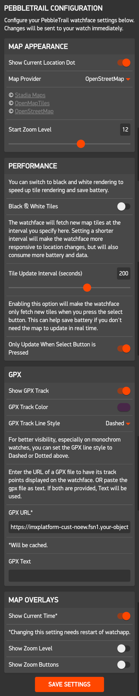

# PebbleTrail Map
> May your trails be pebbly and your Pebbles trail-worthy! Stay safe out there, and may your adventures be filled with joy and discovery. Happy trails!

PebbleTrail Map is a Pebble smartwatch application that provides real-time GPS tracking and map rendering with track display. It allows users to view their current location, display GPX tracks, and interact with the map using the watch buttons.

## Features
- Real-time GPS tracking
- Map rendering with different map providers
- GPX track display
  - GPX tracks can be loaded from URL or text input
- Configurable settings for map appearance and behavior
- Button interactions for zooming and updating the map

## Map Providers
PebbleTrail Map supports multiple map providers, which can be configured in the app settings. Some are better suited for color displays, while others are optimized for black-and-white displays.

## Settings
The app provides a settings page where users can customize various aspects of the map and GPX track.

## Copyright and Attribution
Many thanks to the map providers for their services and data. The following attributions are required when using their maps:
 - &copy; <a href="https://stadiamaps.com/" target="_blank">Stadia Maps</a>
 - &copy; <a href="https://openmaptiles.org/" target="_blank">OpenMapTiles</a>
 - &copy; <a href="https://www.openstreetmap.org/copyright" target="_blank">OpenStreetMap</a>

This project was developed with use of AI assistance, which helped in code generation and debugging. The AI was used to enhance the development process and improve code quality.

## Known limitations
- The app relies on the Canvas API for rendering maps, which may not be supported in all environments. If canvas support is unavailable, the app will display an error message on the watch.
- The app does not currently support offline map caching, so an active internet connection is required to load maps and GPX tracks.
- I only tried the app on a Pebble Time, so there may be compatibility issues with other Pebble models or firmware versions.
